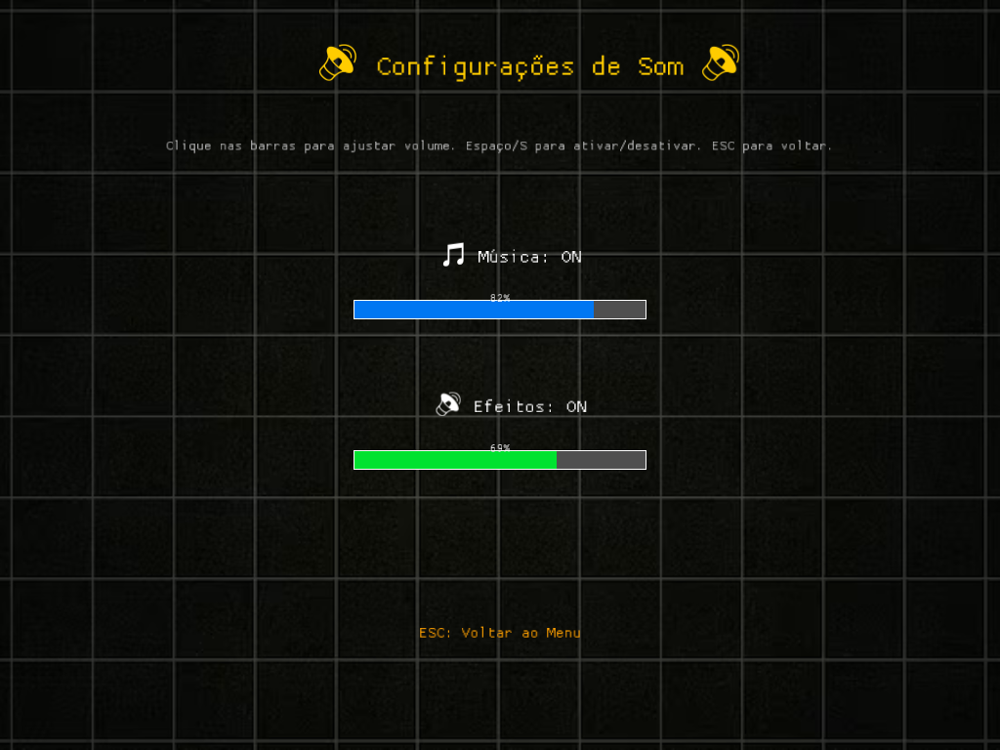

# Dani e os Seres de Papel 🃏✨

A strategic card game developed in Rust using the Macroquad engine.

## 💝 Project Origin

This project was born from two passions: **learning Rust** and **having fun creating**!

The monsters and creatures you'll encounter in the game were drawn by my son **Daniel** - hence the special name: **"Dani e os Seres de Papel"** 🎨✨

It's a family project that combines programming, creativity, and lots of love! 💕

## 📦 Technologies Used
- **Language**: Rust (2024 edition)
- **Engine**: Macroquad (with audio support)
- **Dependencies**:
  - `rand` for random number generation

## 🎮 About the Game
"Dani e os Seres de Papel" is a turn-based game where the player faces enemies using a deck of strategic cards. The game features:

- **Cooldown system** between turns to create strategic rhythm
- **Different card types**: attack, defense, poison, and healing
- **Varied enemies** with distinct behaviors
- **Particle system** for visual feedback
- **Progress persistence** via `save_game.json` file

## 📸 Screenshots

### 🏠 Main Menu


### 👥 Character Selection


### ⚙️ Settings


### ⚔️ Battle Screen


### 🎥 Gameplay Video
[🎮 **Watch Gameplay**](https://youtu.be/OClSfvBDb6o)

*See the game in action and discover strategies to win!*

## 📥 Download and Installation

### 🪟 Windows

#### **Option 1: Release Download (Recommended)**
1. **📥 Download**: Go to [Releases](https://github.com/JefteSG/dani-e-os-seres-de-papel/releases)
2. **📦 Download**: Click on `dani-seres-do-papel-windows.zip`
3. **📂 Extract**: Extract the ZIP file
4. **🎮 Run**: Double-click `dani_seres_do_papel.exe`

⚠️ **Antivirus Issue?** If Windows Defender blocks the file, see [WINDOWS_ANTIVIRUS_FIX.md](WINDOWS_ANTIVIRUS_FIX.md) for solutions.

#### **Option 2: Local Compilation**
```bash
# Install Rust
curl --proto '=https' --tlsv1.2 -sSf https://sh.rustup.rs | sh

# Clone the repository
git clone https://github.com/JefteSG/dani-e-os-seres-de-papel.git
cd dani-e-os-seres-de-papel

# Compile for Windows
cargo build --release --target x86_64-pc-windows-msvc

# Run
./target/x86_64-pc-windows-msvc/release/dani_seres_do_papel.exe
```

### 🐧 Linux

#### **Option 1: Release Download (Recommended)**
1. **📥 Download**: Go to [Releases](https://github.com/JefteSG/dani-e-os-seres-de-papel/releases)
2. **📦 Download**: Click on `dani-seres-do-papel-linux.tar.gz`
3. **📂 Extract**:
   ```bash
   tar -xzf dani-seres-do-papel-linux.tar.gz
   ```
4. **🎮 Run**:
   ```bash
   cd dani-seres-do-papel
   chmod +x dani_seres_do_papel
   ./dani_seres_do_papel
   ```

#### **Option 2: Local Compilation**
```bash
# Install system dependencies
sudo apt-get update
sudo apt-get install -y libasound2-dev libx11-dev libxrandr-dev libxinerama-dev libxcursor-dev libxi-dev

# Install Rust
curl --proto '=https' --tlsv1.2 -sSf https://sh.rustup.rs | sh

# Clone the repository
git clone https://github.com/JefteSG/dani-e-os-seres-de-papel.git
cd dani-seres-do-papel

# Compile
cargo build --release

# Run
./target/release/dani_seres_do_papel
```

### 🍎 macOS

#### **Local Compilation**
```bash
# Install Rust
curl --proto '=https' --tlsv1.2 -sSf https://sh.rustup.rs | sh

# Clone the repository
git clone https://github.com/JefteSG/dani-e-os-seres-de-papel.git
cd dani-e-os-seres-de-papel

# Compile
cargo build --release

# Run
./target/release/dani_seres_do_papel
```

## ⚙️ Cooldown System
The game uses a waiting system between turns to improve gameplay:

| Turn        | Default Time | Description                     |
|-------------|--------------|---------------------------------|
| **Player**  | 1.0 seconds | After using a card              |
| **Enemy**   | 1.0 second  | After enemy performs action     |

Times can be adjusted in the source code as needed.

## 🎵 Assets
The project includes:
- **Sound effects** for cards and actions
- **Background music** in .ogg format
- **Card and enemy art** in PNG
- **Emoji fonts** for visual elements

## 🚀 How to Run (Development)

### Linux/macOS
1. Make sure Rust is installed
2. Clone this repository
3. Run:
   ```bash
   cargo run --release
   ```

### Windows
To compile for Windows from Linux/macOS:

1. **Install Cross** (cross-compilation tool):
   ```bash
   cargo install cross
   ```

2. **Make sure Docker is running**

3. **Compile for Windows**:
   ```bash
   # Using automatic script (recommended)
   ./build-windows.sh

   # Or manually
   cross build --target x86_64-pc-windows-gnu --release
   ```

4. **The executable will be created in**: `target/x86_64-pc-windows-gnu/release/dani_seres_do_papel.exe`

**Note**: MSVC target is not supported by Cross and requires Visual Studio. We recommend using the GNU target which is more stable and compatible.

📖 **Complete documentation**: See [BUILD_WINDOWS.md](BUILD_WINDOWS.md) for detailed instructions.

## 📂 Project Structure
```
src/
├── main.rs            # Entry point
├── deck.rs            # Card system
├── effects.rs         # Game effects
├── enemy.rs           # Enemy logic
├── entity.rs          # Game entities
├── gameturn.rs        # Turn system
├── player.rs          # Player logic
└── state/             # Game state machine
```

## ⚖️ Balancing
The game was designed to allow easy adjustment of:
- Cooldown times
- Card damage
- Enemy behavior
- Game speed

## 📜 License
This project uses fonts under the Open Font License (OFL).

---

Developed with ❤️ using Rust and Macroquad
